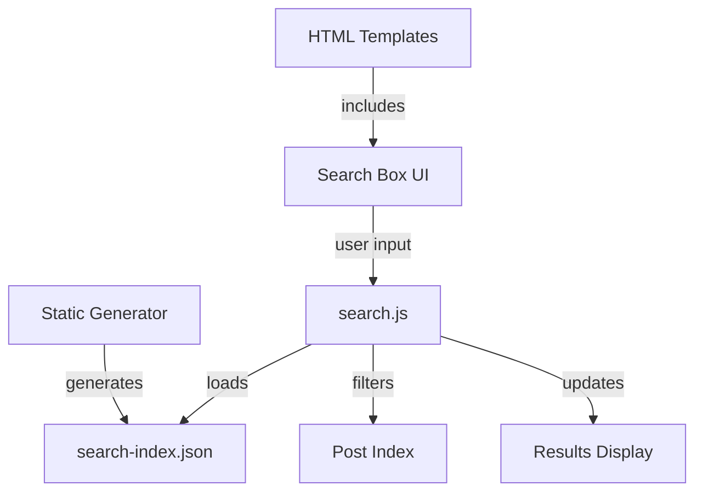

# Design Document: Search Functionality

## Overview

This design document describes the implementation of a client-side search functionality for the mblog static site generator. The search feature will allow users to search blog posts by title, tags, and multiple keywords using an intuitive search box interface. The search will be performed entirely in the browser using a pre-generated JSON index, ensuring fast response times without requiring server-side processing.

The implementation consists of three main components:
1. **Backend**: Python code to generate a searchable JSON index during site generation
2. **Frontend UI**: HTML search box integrated into existing templates
3. **Frontend Logic**: JavaScript search engine that performs real-time filtering

## Architecture

### Component Diagram



### Data Flow

1. **Build Time**: The static generator creates `search-index.json` containing all post metadata
2. **Page Load**: The browser fetches and caches the search index
3. **User Input**: As the user types, the search engine filters the index in real-time
4. **Display**: Matching posts are displayed dynamically, maintaining original date ordering

## Components and Interfaces

### 1. Search Index Generator (Python)

**Location**: `mblog/templates/runtime/generator.py`

**Responsibility**: Generate a JSON file containing searchable post metadata

**Interface**:
```python
def _generate_search_index(self) -> None:
    """
    Generate search index JSON file
    
    Creates a JSON file at {output_dir}/search-index.json containing:
    - Post title
    - Post URL
    - Post date (ISO format)
    - Post tags
    - Post description/excerpt
    """
```

**Integration Point**: Called from `_generate_pages()` method in `StaticGenerator` class

### 2. Search Box UI Component (HTML)

**Location**: 
- `mblog/templates/themes/default/templates/index.html`
- `mblog/templates/themes/default/templates/archive.html`

**Responsibility**: Provide search input interface

**HTML Structure**:
```html
<div class="search-container">
    <input type="text" 
           id="search-input" 
           class="search-box" 
           placeholder="搜索文章... (支持 #标签 多关键字)"
           aria-label="搜索文章">
    <div id="search-results" class="search-results" style="display: none;">
        <!-- Results populated by JavaScript -->
    </div>
</div>
```

### 3. Search Engine (JavaScript)

**Location**: `mblog/templates/themes/default/static/js/search.js`

**Responsibility**: Load index, parse queries, filter posts, display results

**Main Functions**:
```javascript
class SearchEngine {
    constructor(indexUrl)
    async loadIndex()
    parseQuery(queryString)
    search(queryString)
    displayResults(results)
    highlightMatch(text, keywords)
}
```

**Query Parser**:
```javascript
function parseQuery(queryString) {
    // Returns: { tags: ['tag1', 'tag2'], keywords: ['word1', 'word2'] }
}
```

**Search Algorithm**:
```javascript
function search(queryString) {
    const { tags, keywords } = parseQuery(queryString);
    
    return posts.filter(post => {
        // Filter by tags (if any)
        const tagMatch = tags.length === 0 || 
                        tags.every(tag => post.tags.includes(tag));
        
        // Filter by keywords (all must match title)
        const keywordMatch = keywords.length === 0 ||
                            keywords.every(kw => 
                                post.title.toLowerCase().includes(kw.toLowerCase())
                            );
        
        return tagMatch && keywordMatch;
    });
}
```

## Data Models

### Search Index JSON Structure

```json
{
  "posts": [
    {
      "title": "文章标题",
      "url": "/posts/2024-01-01-article-title.html",
      "date": "2024-01-01T00:00:00",
      "tags": ["Python", "Web"],
      "description": "文章摘要或描述",
      "relative_path": "2024-01-01-article-title"
    }
  ],
  "generated_at": "2024-01-07T12:00:00",
  "total_posts": 42
}
```

### Query Object Structure

```javascript
{
  tags: ['tag1', 'tag2'],      // Tags to filter by (from #tag syntax)
  keywords: ['word1', 'word2']  // Keywords to match in title
}
```

### Search Result Object

```javascript
{
  title: "文章标题",
  url: "/posts/article.html",
  date: "2024-01-01",
  tags: ["Python", "Web"],
  description: "文章摘要",
  highlightedTitle: "文章<mark>标题</mark>"  // Title with matched keywords highlighted
}
```


## Correctness Properties

A property is a characteristic or behavior that should hold true across all valid executions of a system—essentially, a formal statement about what the system should do. Properties serve as the bridge between human-readable specifications and machine-verifiable correctness guarantees.

### Property 1: Multi-keyword title matching

*For any* collection of posts and any list of keywords, the search engine should return only posts whose titles contain all specified keywords (case-insensitive).

**Validates: Requirements 2.1, 2.4, 2.6**

### Property 2: Tag filtering

*For any* collection of posts and any tag, the search engine should return only posts that have the specified tag in their tags list.

**Validates: Requirements 2.7**

### Property 3: Combined tag and keyword filtering

*For any* collection of posts, any set of tags, and any set of keywords, the search engine should return only posts that match all specified tags AND contain all specified keywords in their titles.

**Validates: Requirements 2.8**

### Property 4: Query parsing separates tags and keywords

*For any* search query string, the query parser should correctly identify all tag tokens (prefixed with #) and all keyword tokens (not prefixed with #), treating consecutive spaces as single separators.

**Validates: Requirements 7.1, 7.2, 7.4**

### Property 5: Search results maintain date ordering

*For any* collection of posts and any search query, the filtered results should maintain the same relative date ordering as the original collection (newest first).

**Validates: Requirements 3.4**

### Property 6: Search index contains all required fields

*For any* generated search index, each post entry should contain title, URL, date, tags, and description fields.

**Validates: Requirements 4.2**

### Property 7: Result display includes required information

*For any* search result rendered to HTML, the output should contain the post title, date, and description.

**Validates: Requirements 3.1**

### Property 8: Result links are valid

*For any* search result, the rendered HTML should contain a valid link (anchor tag with href) to the post URL.

**Validates: Requirements 3.2**

### Property 9: Matched keywords are highlighted

*For any* search result with keyword matches, the rendered title should wrap matched keywords in highlight markup (e.g., `<mark>` tags).

**Validates: Requirements 3.3**

### Property 10: Unicode support in search

*For any* post title and search query containing Unicode characters (including Chinese, emoji, etc.), the search engine should correctly perform case-insensitive matching.

**Validates: Requirements 6.4**

## Error Handling

### Invalid Input Handling

1. **Empty Query**: When the search query is empty or contains only whitespace, display all posts (no filtering)
2. **Malformed Tag Syntax**: When a query contains "#" without a tag name (e.g., "# keyword"), treat "#" as a regular character to search for
3. **Special Characters**: Escape special regex characters in user input to prevent regex injection
4. **Missing Index**: If the search index fails to load, display an error message and disable search functionality

### Edge Cases

1. **No Results**: Display a friendly "No results found" message when no posts match the query
2. **Chinese Characters**: Ensure proper Unicode handling for Chinese and other non-ASCII characters
3. **Mixed Languages**: Support queries mixing English and Chinese characters
4. **Very Long Queries**: Truncate or handle queries exceeding reasonable length (e.g., 200 characters)
5. **Large Post Collections**: Optimize for blogs with up to 1000 posts, maintaining sub-100ms response time

### Error Messages

```javascript
const ERROR_MESSAGES = {
    INDEX_LOAD_FAILED: '搜索索引加载失败，请刷新页面重试',
    NO_RESULTS: '没有找到匹配的文章',
    SEARCH_ERROR: '搜索时发生错误，请重试'
};
```

## Testing Strategy

### Dual Testing Approach

This feature will be tested using both unit tests and property-based tests:

- **Unit tests**: Verify specific examples, edge cases, and error conditions
- **Property tests**: Verify universal properties across all inputs

Both testing approaches are complementary and necessary for comprehensive coverage. Unit tests catch concrete bugs in specific scenarios, while property tests verify general correctness across a wide range of inputs.

### Property-Based Testing

We will use a property-based testing library for JavaScript (such as `fast-check` for Node.js testing) to implement the correctness properties defined above. Each property test will:

- Run a minimum of 100 iterations with randomly generated inputs
- Be tagged with a comment referencing the design property
- Tag format: `// Feature: search-functionality, Property N: [property text]`

**Example Property Test Structure**:

```javascript
// Feature: search-functionality, Property 1: Multi-keyword title matching
test('search returns only posts matching all keywords', () => {
    fc.assert(
        fc.property(
            fc.array(arbitraryPost()),
            fc.array(fc.string()),
            (posts, keywords) => {
                const results = searchEngine.search(keywords.join(' '));
                return results.every(post => 
                    keywords.every(kw => 
                        post.title.toLowerCase().includes(kw.toLowerCase())
                    )
                );
            }
        ),
        { numRuns: 100 }
    );
});
```

### Unit Testing

Unit tests will focus on:

1. **Specific Examples**: Test known input/output pairs
   - Search for "Python" returns posts with "Python" in title
   - Search for "#web" returns posts tagged with "web"
   - Search for "#python tutorial" returns posts tagged "python" with "tutorial" in title

2. **Edge Cases**:
   - Empty query returns all posts
   - Query with no matches returns empty array
   - Chinese character searches work correctly
   - Mixed English/Chinese queries work correctly
   - Malformed tag syntax (e.g., "# keyword") is handled gracefully

3. **Integration Points**:
   - Search index is generated correctly during build
   - Search index file exists at expected path
   - Search box appears on index and archive pages

4. **Error Conditions**:
   - Failed index load shows error message
   - Invalid JSON in index is handled gracefully

### Test Organization

```
tests/
├── test_search_index_generation.py    # Python unit tests for index generation
├── test_search_engine.js              # JavaScript unit tests for search logic
└── test_search_properties.js          # JavaScript property-based tests
```

### Testing Tools

- **Python**: pytest for unit tests
- **JavaScript**: Jest or Mocha for unit tests
- **Property Testing**: fast-check library for JavaScript property-based tests
- **Test Coverage**: Aim for >90% code coverage for search-related code

### Continuous Integration

All tests should run automatically on:
- Every commit to the repository
- Pull requests before merging
- Release builds

Property-based tests should be configured to run with at least 100 iterations in CI to catch edge cases that might not appear in unit tests.
